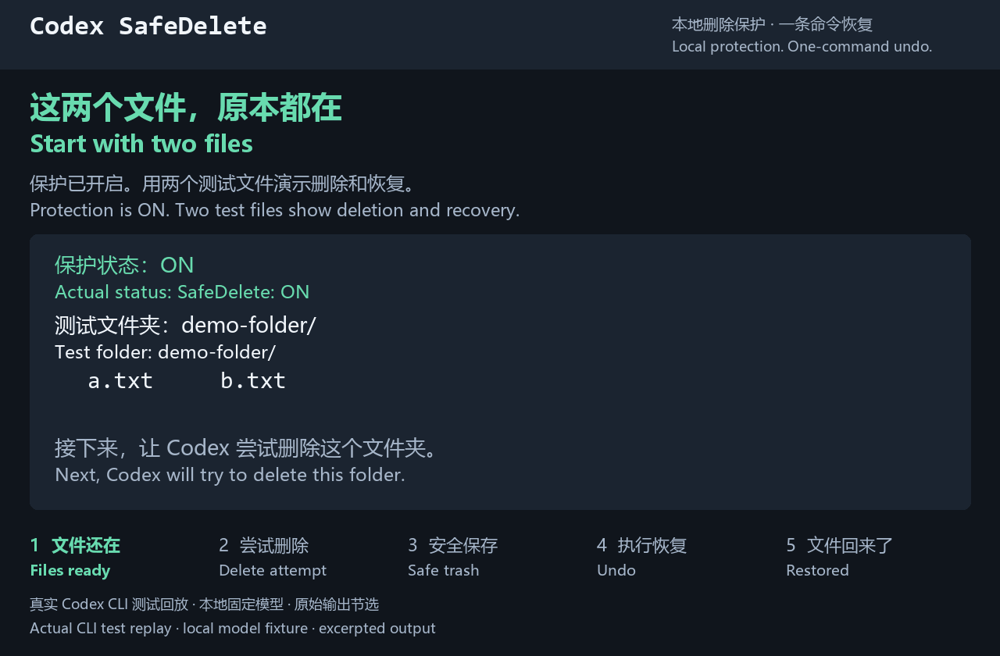

# Codex SafeDelete

[English](README.md) | [简体中文](README.zh-CN.md)

Windows 上 Codex 的本地删除保护，误删后一条命令恢复。

识别支持的删除命令，拦截原删除操作，将目标移入可恢复的本地保存区。
`safedelete undo` 可恢复成功保存的文件和目录。

**仅本地运行。** 无需账号、不上传文件、无后台服务。
**保护范围：** 已识别的删除命令；此 Hook 不提供操作系统级隔离。

## 快速开始

### 安装

需要 Windows 10 1809 或更新版本、PowerShell 5.1 或更新版本，以及本地
`codex.exe`（Codex Desktop 自带）。实际验证环境为 Windows 11，
详见[兼容性与验证](#兼容性与验证)。

1. 在本仓库的 GitHub 页面选择 **Code → Download ZIP**。
   [GitHub 下载说明](https://docs.github.com/en/repositories/working-with-files/using-files/downloading-source-code-archives)
2. 完整解压 ZIP，进入解压后的项目目录。
3. 双击 **`Install SafeDelete.cmd`**，等待安装成功。
4. **彻底退出 Codex 后重新启动**，再打开新的 Windows PowerShell 终端，检查：

```powershell
safedelete status
```

结果应为 `ON`。安装不会刷新已经运行的聊天；在同一个运行中的应用里新建聊天，
不等于完整重启。已有旧版请按[升级步骤](#升级已有安装)处理。

### 误删了？

在发生删除的原项目目录打开 Windows PowerShell，再运行：

```powershell
safedelete undo
```



中英字幕演示依据隔离环境中 Codex CLI 与固定本地模型测试桩的真实删除、恢复结果制作。
命令和输出为节选重播，启动等待已压缩。

### 暂停保护

双击 **`Pause SafeDelete.cmd`**，或运行：

```powershell
safedelete off
```

**警告：OFF 时 Codex 可以永久删除文件。** 之前保存的文件和恢复记录仍可使用。

### 恢复保护

双击 **`Resume SafeDelete.cmd`**，或运行：

```powershell
safedelete on
```

## 查看状态

```powershell
safedelete status
```

`ON` 表示本地 Hook 已注册、启用、受信任且通过验证。
`OFF` 表示保护已暂停。`UNKNOWN` 表示配置需要处理；命令会返回错误，不会声称保护已启用。
这是本地注册和 Hook 执行检查，不证明已经运行的聊天加载了配置。
安装或升级后仍须完整重启 Codex。

## 升级已有安装

重复安装只验证已有程序，不会升级文件。若新旧程序文件不同，安装会退出并保留现有安装。

1. 使用**原版本项目目录**里的 **`Uninstall SafeDelete.cmd`** 卸载。
   若提示配置冲突，查看[卸载说明](#卸载)。
2. 彻底退出 Codex 后重新启动，并打开新终端。
3. 下载并完整解压新版本，双击新目录中的 **`Install SafeDelete.cmd`**。
4. 安装成功后，再次彻底退出 Codex 后重新启动，打开新终端，
   执行 `safedelete status` 确认 `ON`。

卸载和升级会保留项目中已保存的文件及恢复历史。

## 卸载

双击 **`Uninstall SafeDelete.cmd`**。

卸载完成后彻底退出 Codex 后重新启动，并打开新终端，清除正在运行的旧 Hook、刷新 PATH。

暂停只临时关闭保护，SafeDelete 仍然安装。
卸载会移除 SafeDelete，恢复原 Codex 配置及安装程序改动的 PATH。
若安装后改过配置或 PATH，卸载会先停止，并提示检查备份。
两者都保留项目中已保存的文件和恢复记录。

<details>
<summary>卸载细节</summary>

也可以在原版本项目目录用 PowerShell 卸载：

```powershell
.\uninstall.ps1
```

请用双击入口或独立 PowerShell 终端安装、卸载。
Hook 会拒绝代理调用的不透明脚本。

安装会保留已有 Hook，并逐字节备份原 Codex 配置。
完整安装后的卸载恢复原配置，并还原安装程序记录的 PATH 修改；项目内的恢复文件保留。
若用户后来修改了配置或 PATH，卸载会停止，避免覆盖，并提供备份位置。
若安装已完整回滚，卸载只清理残留安装文件，保留当前配置和 PATH。
Desktop 的临时 `codex-computer-use` 命名管道 GUID 变化，仅在内存回填该值后，
整份配置哈希与已安装配置完全匹配时接受；其他配置或 PATH 变化仍会阻止卸载。

</details>

```text
Codex 尝试删除：
Remove-Item -Recurse -Force src/

SafeDelete：
已拦截 → 移入可恢复的本地保存区

safedelete undo
→ src/ 已恢复
```

## 兼容性与验证

**Windows 本地 MVP／预览版。** 采用 MIT 许可证。

| 环境 | 实际验证 |
| --- | --- |
| PowerShell 5.1 / 7，Windows build 22631 (23H2) | 已验证；尚未在独立 Windows 10 电脑测试 |
| Codex CLI 0.160.0，本地 `codex.exe` | 真实 Hook → 安全保存 → undo → 卸载通过 |
| Codex Desktop 26.930.3930.0 | 真实安装、完全重启、删除拦截、undo、默认卸载通过 |
| PowerShell 5.1 / 7 混用、Windows 936 / 65001 代码页 | 特殊字符路径、二进制内容及空目录已验证 |
| Windows 7 / 8，或 Windows 10 1809 之前的版本 | 不支持 Codex 集成；安装会在修改配置前退出 |
| Linux / macOS | 尚未提供安装入口和平台适配；当前版本不支持 |

2026-10-05 修复版已通过实际升级、默认卸载回装，以及用户确认完整重启 Desktop 后的
删除拦截、按 ID 恢复和 patch 删除拒绝。安装或升级后请重开 Codex 和终端；
仍在运行的旧聊天在安装后的首次删除没有被拦截。
本轮范围和保留的失败记录见 [验证说明](VERIFICATION-20261005.md) 与
[TEST-RESULTS.md](TEST-RESULTS.md)。

安装要求 Windows 10 1809（build 17763）或更新版本，以及 PowerShell 5.1 或更新版本。
系统边界依据 [Codex 官方 Windows 说明](https://learn.chatgpt.com/docs/windows/windows-sandbox)：
推荐 Windows 11，Windows 10 属于尽力支持范围。

暂停与恢复、Desktop 完全重启后的状态持久化、旧记录恢复和默认卸载也已验证。
本机 Desktop 测试需要用户手动允许 360 对 Hook 和控制台宿主的提示。
尚未证明默认兼容 360 或其他杀毒软件。Hook 若被安全软件阻止，就无法保护删除。
请先审阅脚本和提示，再决定是否允许运行；安装程序不会修改杀毒软件设置或添加排除项。
自检使用可读命令。

## 安装说明与故障处理

### 安装检查与重试

双击入口使用 Windows PowerShell 5.1，无需管理员权限，并保留结果窗口。
执行策略绕过仅用于本次进程，不改变已保存的执行策略。
现有安装程序会检查 Hook 注册、信任和执行，验证成功才报告安装完成。
若 PATH 中没有 `codex.exe`，会自动检查 Codex Desktop 的本地程序目录。
若本地 Codex 初始化超时且回滚已完成，先双击 `Uninstall SafeDelete.cmd` 清理残留安装，
再双击 `Install SafeDelete.cmd` 重试。清理会保留回滚后对配置和 PATH 的修改。
若回滚未完成，先检查错误及保留的配置备份，再处理重试。

### 安装位置与旧版迁移

默认程序目录是 `%USERPROFILE%\.codex-safedelete-app`，资源管理器和 Codex 都能访问。
旧 AppData 目录可能被 MSIX 桌面应用重定向到包缓存，导致双击安装时只看到 Hook 注册。
安装会备份并迁移可验证的旧默认安装，保留原配置备份、暂停状态和项目恢复记录。
迁移后暂停、恢复和状态检查会同时验证仍存在的旧缓存 Hook，保证重启前开关一致。
多个旧安装、配置冲突或缺少有效状态时会保留文件并提示处理，不会盲删注册。

### 已有安装或配置冲突

同一 Windows 用户不能同时对相同安装目录或 Codex 配置执行安装、卸载。
若另一个操作正在占用，本次操作会退出且不做修改；等它完成后再重试。

若已有 SafeDelete 注册但缺少对应安装状态，安装会在修改文件前退出，避免再添加一份 Hook。
验证会合并同一 key 的完全相同报告；不同注册或相互冲突的记录会报错，并显示来源和 key。
已有安装请使用原卸载程序处理；状态缺失或不完整时，请保留错误和配置备份再检查。

### 用 PowerShell 安装

高级用户可在解压后的项目目录用 PowerShell 安装：

```powershell
.\install.ps1
```

若 Windows 阻止下载的脚本，审阅后可运行：

```powershell
powershell -NoProfile -ExecutionPolicy Bypass -File .\install.ps1
```

重新打开 Codex 和终端。在 Codex `/hooks` 中确认 SafeDelete 已启用并受信任。
安装程序通过本地 Codex app-server 验证注册；版本不支持时会报错并回滚。

## 恢复命令与文件保存

在发生删除的项目目录运行：

```powershell
safedelete undo           # 恢复当前项目最近一条可恢复删除
safedelete list           # 查看记录与原路径
safedelete restore <id>   # 恢复指定记录
safedelete delete src/    # 主动安全删除
```

文件保存在 `.codex-safedelete/trash/`。`history.json` 记录原路径、名称、UTC 时间、恢复路径和触发命令。
恢复不会覆盖已有路径。需要恢复期间，请保留该目录。

未实际移动文件的失败删除不会挡住之前有效删除的撤销。
删除和恢复会读取内容生成本地校验值，以便安全核对中断记录；大文件可能耗时更长。
旧版中断记录可能缺少这些校验信息，需要核对后手工恢复，剩余保存区文件仍会保留。

## 保护行为与范围

### 暂停状态

暂停开关对整套安装生效，重启 Codex 后仍保留。
它只修改安装目录中的 `protection-state.json`，不修改 Codex 配置或 PATH。
Hook 每次调用都会读取状态。OFF 时 `list`、`undo`、`restore` 和主动执行的 `safedelete delete`
仍可使用。状态文件缺失时保持保护；文件损坏时拒绝命令。
只有在确实想停止保护时才暂停；代理不得用暂停绕过被拒绝的删除。
暂停功能出现前安装的旧版，需要先用原卸载程序卸载；安装程序不会静默覆盖。

### 支持的删除命令

自动恢复支持 PowerShell 的字面量删除命令。默认 Windows Shell 下请使用 `Remove-Item`。
`rm`、`del`、`erase`、`rmdir`、`rd` 等歧义别名需要明确的 PowerShell Shell 信息，
或 `powershell -NoProfile -Command` / `pwsh -NoProfile -Command` 包装；缺少这些信息时会拒绝。
PowerShell 包装命令必须带 `-NoProfile` 才能自动恢复。启动时指定目录
（`-WorkingDirectory` / `-wd`）、动态或未知启动参数、不支持的删除选项均拒绝。
请用工具的 `workdir` 指定工作目录。
原删除命令被本地 SafeDelete CLI 替代，将实际工作目录内的明确目标移入恢复区。
Bash、sh、CMD、WSL 的删除命令会拒绝；请在 Windows PowerShell 终端使用 `safedelete delete`。
`git clean` 和 `git reset --hard` 始终拒绝。
项目根目录、项目外路径、`.git`、`.env`、`.ssh`、恢复区、`.codex`、链接/联接点，以及一次超过
**1000 个文件或目录**的删除均拒绝。包含受保护路径的目录、Windows 大小写敏感目录也拒绝。
无法可靠确认目录语义时会拒绝，包括部分网络共享。
通配符、动态删除路径、混合删除与其他操作的命令会被拒绝；请拆开命令，或向 `safedelete delete`
传入明确路径。

普通 `git status`、`npm test` 和源码编辑不受影响。
不透明 shell 脚本、编码命令和交互式 shell 会被拒绝。
Hook 检查失败或超过 20 秒预算时会明确拒绝原命令，避免慢盘或检查进程故障后继续删除。
明确的 `apply_patch` Delete File 指令也拒绝，请先使用 `safedelete delete`；普通补丁继续运行。
项目通过 `.git` 或最近的恢复区识别；没有这些标记时，当前目录就是项目根目录。

### 覆盖边界

**范围：** 这是 shell 命令安全保护，不是操作系统沙箱。
Codex 必须加载受信任的 PreToolUse Hook。
任意程序、自定义工具、删去文件内容的编辑、文件重命名，以及后来通过 `write_stdin`
发送给交互进程的命令，均不在本 MVP 覆盖范围。
不要用交互式 shell 或绕过 Hook 来删除文件。`SKILL.md` 提供代理使用指导；即使不用 Skill，
Hook 也会处理已识别的 shell 删除。安装前已永久删除的文件无法恢复。
更广泛的保护请使用系统备份。

实际运行记录、命令与限制见 [TEST-RESULTS.md](TEST-RESULTS.md)。
Node/npm 和 Python 仅用于测试，产品运行不需要它们。

已验证的 Hook API 为 Codex CLI 0.160.0 的
[`hooks.json` / PreToolUse](https://learn.chatgpt.com/docs/hooks)。
本 MVP 需要本地 `codex.exe`（Codex Desktop 自带）以及 PowerShell 命令环境。
安装程序尚不支持 npm 的 `codex.cmd` 启动器。
上述 Desktop 结果来自完全重启后真实执行的代理命令，不只是 CLI 或本地 app-server 探测。
